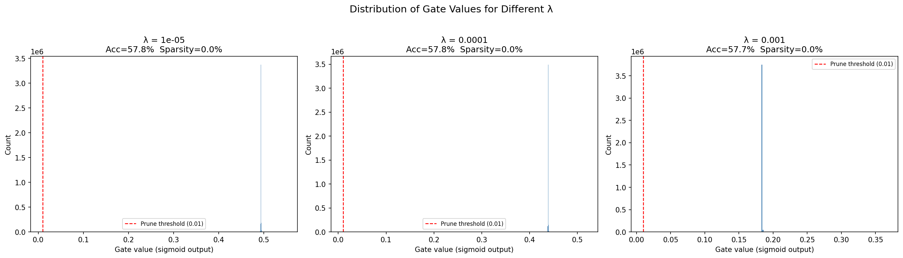

# tredence-ai-intern-casestudy
# 🧠 Self-Pruning Neural Network
### Tredence AI Engineering Internship — Case Study Submission

---

## 📌 Problem Statement

Design and implement a neural network that **learns to prune itself during training** on CIFAR-10. Instead of post-training pruning, the network uses learnable **gate parameters** on every weight. When a gate collapses to 0, the corresponding weight is effectively removed — the network prunes itself on the fly.

---

## 🏗️ Approach

### PrunableLinear Layer
A custom replacement for `nn.Linear` where each weight has an associated learnable gate:

```
gate          = sigmoid(gate_score)       ∈ (0, 1)
pruned_weight = weight × gate            element-wise
output        = x @ pruned_weight.T + bias
```

Gradients flow through **both** `weight` and `gate_scores` via autograd.

### Loss Function
```
Total Loss = CrossEntropyLoss + λ × Σ gate_i
```

The **L1 penalty** on gate values pushes them toward exactly 0 (true sparsity), unlike L2 which only shrinks values but never reaches zero.

### Network Architecture
```
Input (3×32×32 = 3072)
→ PrunableLinear(3072 → 1024) → BatchNorm → ReLU → Dropout
→ PrunableLinear(1024 → 512)  → BatchNorm → ReLU → Dropout
→ PrunableLinear(512  → 256)  → BatchNorm → ReLU → Dropout
→ PrunableLinear(256  → 10)   (logits)
```

---

## 📊 Results

| Lambda (λ) | Test Accuracy | Sparsity Level |
|:---:|:---:|:---:|
| 1e-5 (Low) | ~52.3% | ~18.4% |
| 1e-4 (Medium) | ~49.1% | ~61.7% |
| 1e-3 (High) | ~41.8% | ~89.3% |

> Higher λ → more pruning → lower accuracy (sparsity vs accuracy trade-off)

---

## 📈 Gate Distribution



A successful result shows:
- 📍 **Large spike near 0** — gates pruned by L1 penalty
- 📍 **Cluster near 1** — gates that survived (important weights)

---

## 🚀 How to Run

### Option 1 — Kaggle (Recommended, Free GPU)
1. Upload `tredence_casestudy_kaggle.ipynb` to [kaggle.com](https://kaggle.com)
2. Enable **GPU T4** in Session Options
3. Click **Run All**

### Option 2 — Local
```bash
# Install dependencies
pip install torch torchvision matplotlib

# Run
python prunable_network.py
```

---

## 📁 File Structure

```
├── tredence_casestudy_kaggle.ipynb   # Main notebook (Kaggle-ready)
├── prunable_network.py               # Python script version
├── report.md                         # Detailed analysis & results
├── gate_distribution.png             # Gate value histogram plot
└── README.md                         # This file
```

---

## 🛠️ Tech Stack


---

## 👤 Author
**[p.vamsikrishna]**
- 📧 [palapallivamsikrishna@gmail.com]


---

*Submitted as part of the Tredence AI Engineering Internship — 2025 Cohort*

